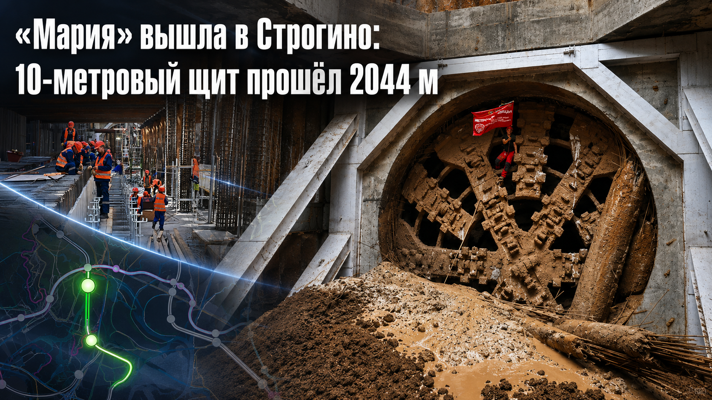
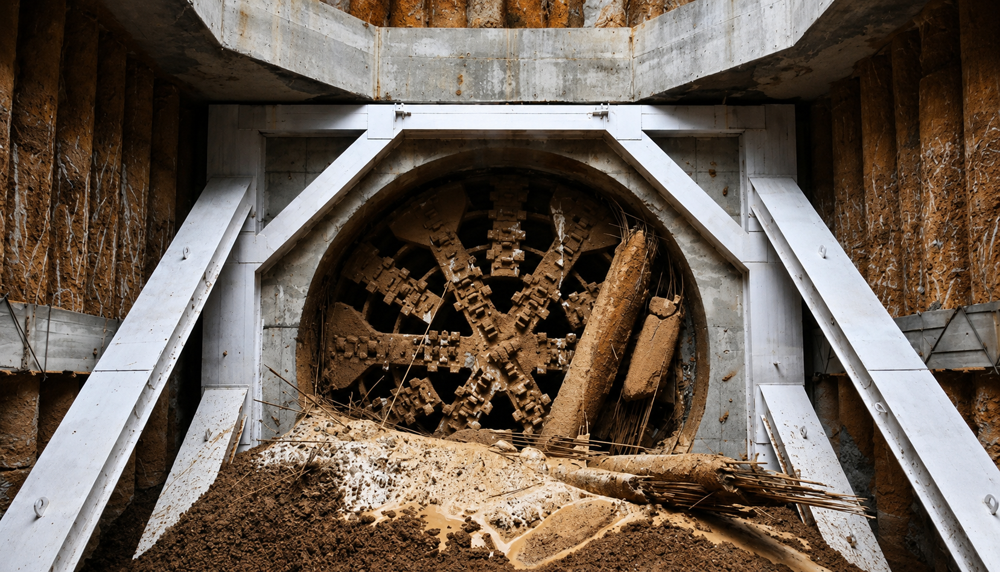
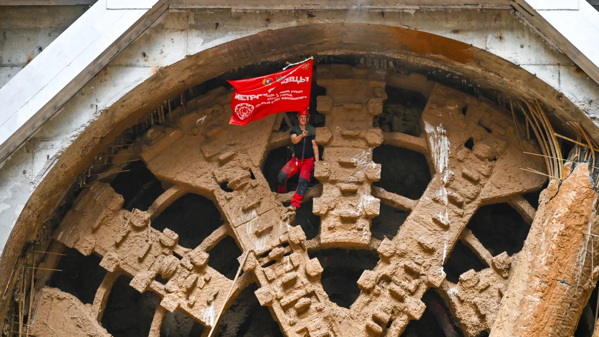
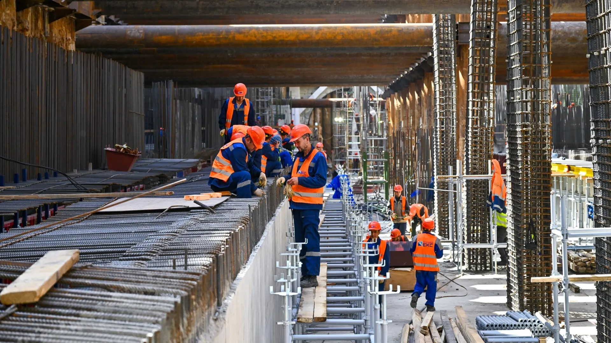
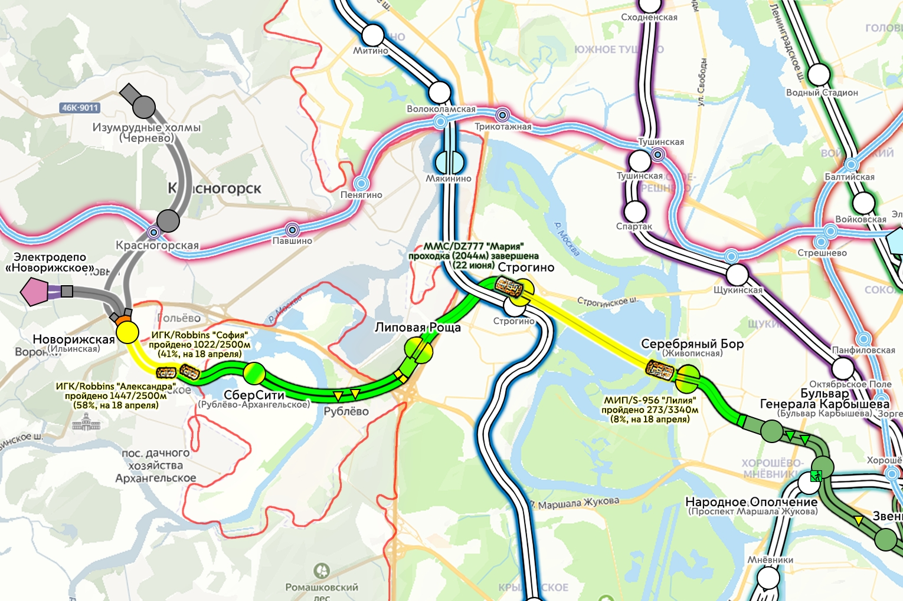

# «Мария» вышла в Строгино: 10-метровый щит прошёл 2044 м

*Под МКАД, действующей синей веткой и Москвой-рекой. Как 10-метровый щит превратил проектный отрезок Рублёво-Архангельской линии в реальную подземную конструкцию.*

**Снимок 1.** Финиш «Марии» в приёмной камере «Строгино»: ротор, портал, грунт и пульпа.

## Ротор после 2044 метров

На снимке — последствия проходки: мокрая глина у портала, налипший грунт на роторе и белая силовая рама приёмной камеры. В центре — ротор «Марии» после 2044 метров.

В Москве завершена проходка двухпутного тоннеля между станциями «Липовая Роща» и «Строгино» Рублёво-Архангельской линии. Щит диаметром 10 м прошёл 2,04 км и вошёл в станционный котлован будущей пересадки. Трасса шла под МКАД, под действующей Арбатско-Покровской линией и на маршруте, где ещё при старте отдельно отмечали прохождение под Москвой-рекой.[^finish_stroi][^start_stroi]

Новость сама по себе короткая. Машина дошла. Точка.

Но для «Техники — молодёжи» интерес начинается как раз здесь: почему диаметр 10 м меняет класс задачи, чем двухпутный тоннель отличается от двух однопутных и почему финиш щита требует такой же точности, как сама проходка.

## Паспорт проходки

| Параметр | Данные по открытому контуру |
|---|---|
| Линия | Рублёво-Архангельская линия метро, графитовый радиус |
| Перегон | «Липовая Роща» — «Строгино» |
| Машина | ТПМК «Мария»; на инфографике РМТМ указан индекс ММС/DZ777 |
| Диаметр | 10 м |
| Тип выработки | большой двухпутный тоннель |
| Длина | 2,04 км; на инфографике РМТМ — 2044 м |
| Старт | 31 июля 2025 года, от стройплощадки «Липовой Рощи» к «Строгино»[^start_stroi] |
| Финиш | 22 июня 2026 года[^finish_stroi] |
| Календарная длительность | 326 суток |
| Средний календарный темп | около 6,3 м/сутки, или ~190 м/месяц |
| Максимальная глубина | 40,2 м[^start_stroi] |
| Сложные зоны | МКАД, действующая Арбатско-Покровская линия, участок под Москвой-рекой[^finish_stroi][^start_stroi] |

**Примечание.** По фотографиям заметна пульпа — признак работы с водонасыщенной грунтовой массой. Подробные технические параметры машины — режим забоя, мощность привода, система выдачи грунта и число домкратов — в открытых источниках не раскрыты.

## Почему 10 метров — это не «плюс четыре»

Диаметр обманчив. Кажется: 10 м против условных 6 м — разница всего в четыре метра. Но площадь забоя растёт по квадрату диаметра:

$$
(10 / 6)^2 ≈ 2,78
$$

То есть 10-метровая машина встречает почти в 2,8 раза большую площадь грунта, чем шестиметровая. А значит, за каждый метр хода надо разрушить, принять и вывести гораздо больше породы. Увеличивается и силовая часть: крупнее корпус, тяжелее сборная железобетонная обделка, мощнее эректор, выше нагрузка на домкраты.

В тоннеле это быстро перестаёт быть арифметикой. Растут усилия, объём выдачи грунта, масса тюбингов, требования к порталу и к контролю осадок. Двухпутный тоннель даёт одну большую трубу вместо двух малых — удобно для эксплуатации и компоновки станций. Цена — огромный забой, сложная стабилизация грунта и массивный портал. На снимке 1 это особенно заметно: ротор почти полностью заполняет проём приёмной камеры.

## Как работает такая машина

ТПМК часто называют «буром». Неверно. Бур делает отверстие. Щит ведёт управляемую выработку и сразу собирает её стенки.

Впереди ротор. Его режущие элементы разрушают грунт по всей площади забоя. За ротором — рабочая камера, куда попадает порода. Дальше её надо вывести: шнеком, конвейером, гидротранспортом или смешанной схемой. Какая именно система стояла на «Марии» в этом проходе, открытые источники не уточняют; мокрая масса у портала показывает только одно — забой был не «сухим».

Щит движется не на колёсах. Гидродомкраты упираются в уже собранное кольцо обделки и продавливают корпус вперёд. За машиной тоннель не остаётся голой выработкой: ТПМК такого класса обычно собирает кольца из сборных железобетонных тюбингов. Для диаметра 10 м это крупногабаритная сборка: эректор должен точно поставить тяжёлые тюбинги, а домкраты — передать усилие через готовое кольцо без перекоса.

Отдельная служба держит геометрию. Маркшейдеры и система навигации ведут ось, уклон, радиусы, отметки. На перегоне к «Строгино» это особенно важно: щит должен был точно попасть в подготовленный портал станции рядом с действующими тоннелями. Ошибка даже в несколько сантиметров на старте могла стать проблемой на финише.

## Второй снимок: человек как масштабная линейка

**Снимок 2.** Рабочий в роторе «Марии». Масштаб читается без подписи.

На снимке 2 человек сидит внутри режущего органа и держит красный флаг «Метростроя». Символика флага понятна. Технически важнее масштаб: человек буквально помещается внутри ротора.

Без человеческой фигуры ротор был бы просто крупной деталью. С ней видно: в эту машину можно войти. Полости ротора, рёбра, налипший грунт, тёмные окна за режущим органом — всё работает как линейка.

И ещё деталь. Ротор не чистый. Он забит грунтовой массой. Это нормальное рабочее состояние машины после реальной проходки.

## Третий снимок: станция в стадии скелета

**Снимок 3.** «Строгино» РАЛ: арматура, временные конструкции, монтаж станционного объёма.

Третий снимок полезен своей будничностью. Нет ротора. Нет флага. Есть люди на арматуре, настилы, стойки, вертикальные каркасы, металлические распорки и длинный котлован с рабочими зонами.

Это стадия скелета. Станция уже перестала быть земляной ямой, но ещё не стала пассажирским пространством. Здесь собирают то, что потом спрячется: силовые элементы, монолит, каналы инженерии, примыкания, технологические помещения.

После проходки придут пути, кабельные трассы, тяговое хозяйство, вентиляция, водоотвод, связь, автоматика, пожарные системы. На первом участке Рублёво-Архангельской линии во время технического пуска проверяют тоннели, пути, оборудование, инженерные сети, системы жизнеобеспечения, автоматику, телемеханику, тяговую сеть и радиосвязь.[^tech_mos]

Финиш щита — передача эстафеты от горнопроходчиков к тем, кто превращает выработку в транспортную систему.

## Четвёртый снимок: карта стройки

**Снимок 4.** Карта РМТМ: «Мария» дошла до «Строгино», соседние комплексы работают на других участках.

Инфографику легко принять за обычную схему метро. Но это скорее производственный журнал, положенный на карту.

На ней у «Строгино» указано: ММС/DZ777 «Мария», проходка 2044 м завершена 22 июня. Западнее видны «Липовая Роща», «Рублёво», «СберСити / Рублёво-Архангельское», «Новорижская», электродепо «Новорижское», перспективные точки «Красногорская» и «Изумрудные холмы».

| Комплекс на схеме | Что показано на карте | Прогресс на инфографике |
|---|---|---|
| «Мария» | «Липовая Роща» — «Строгино» | 2044 м, завершено 22 июня 2026 года |
| «Лилия» | участок в районе «Серебряного Бора» и «Строгино» | 273/3340 м, 8% на 18 апреля 2026 года |
| «София» | западный участок к «Новорижской» | 1022/2500 м, 41% на 18 апреля 2026 года |
| «Александра» | параллельный западный участок к «Новорижской» | 1447/2500 м, 58% на 18 апреля 2026 года |

Разница между ними не только в именах. «Мария» ведёт большой двухпутный тоннель диаметром 10 м. Другие комплексы на схеме показывают, что линию строят сразу несколькими фронтами: где-то ротор уже вышел, где-то перегон ещё набирает метры, где-то западное продолжение пока остаётся перспективой.

Метро строят не линией на карте. Его строят камерами, перегонами, станциями, переборками, монтажом систем и приёмками.

## Самый нервный участок — не на схеме, а в грунте

Перегон «Липовая Роща» — «Строгино» на карте выглядит аккуратной дугой. Под землёй это коридор с несколькими зонами риска.

Первая — действующая Арбатско-Покровская линия. Рядом уже есть тоннели, путь, кабели, водоотвод, вентиляция. Метро нельзя остановить «на время эксперимента». Оно работает.

Вторая — МКАД. Постоянная транспортная нагрузка, развязки, коммуникации, плотная городская поверхность.

Третья — Москва-река. О прохождении под рекой говорили ещё на старте «Марии».[^start_stroi] Для проходчика это не голубая линия на плане, а вода в грунте, фильтрация, водопритоки и строгий контроль устойчивости забоя.

Четвёртая — сам выход в приёмную камеру «Строгино». Это отдельный технологический манёвр: точный выход по оси, раскрытие портала и переход от режима проходки к стационарным работам.

## Врезка ТМ: риски и контроль

| Узел риска | Что может пойти не так | Что держат под наблюдением |
|---|---|---|
| Осадки поверхности | осадки и деформации поверхности над тоннелем | мониторинг реперов, темп проходки, давление в забое |
| Большой забой | потеря устойчивости грунта, неравномерный вынос породы | темп хода, состояние забоя, объём выдачи грунта |
| Водонасыщенная зона | водоприток, разжижение грунта, рост давления | давление, притоки, качество обделки, герметичность стыков |
| Действующая синяя линия | осадки, вибрации, влияние на путь и тоннельные конструкции | геометрию тоннелей, реперы, состояние пути |
| МКАД и городская поверхность | осадка покрытия, влияние на коммуникации | мониторинг поверхности, деформации, контрольные отметки |
| Приёмная камера | ошибка выхода, раскрытие контура, нештатный приток грунта | ось щита, состояние портала, крепление, порядок разборки |
| Крупная логистика | задержки тюбингов, накопление породы, перегрузка площадки | график поставок, вывоз, работа кранов, складирование |

Эта таблица не заменяет проектный том. Она показывает, почему слово «прошёл» в метрострое означает не только движение машины вперёд.

## 326 суток: скорость или осторожность?

Считаем без украшений. Старт — 31 июля 2025 года. Финиш — 22 июня 2026 года. Между датами 326 суток. При длине 2044 м средний календарный темп получается около 6,3 м/сутки.

Это не скорость ротора и не производительность в смену.

В календарь попадает всё: подготовка, осторожные режимы в сложных зонах, остановки на обслуживание, замена инструмента, подход к действующей инфраструктуре, участок под рекой, выход в приёмную камеру. Для большого щита это не «потерянное время», а часть технологии. Машину нельзя гнать как самосвал по прямой дороге. Она идёт в среде, которая каждый метр отвечает по-своему.

Календарный темп отражает не только скорость проходки, но и необходимую осторожность в сложных городских условиях.

Сравнение даёт соседний участок той же линии. Между «Шелепихой» и «Звенигородской» тоннели расширяли с 6 до 10 м: около 350 м прошёл механизированный комплекс, более 330 м строители прошли вручную, всего извлекли 34 тыс. куб. м грунта.[^rebuild] Даже внутри одной линии методы резко меняются: где-то работает машина, где-то приходится идти почти хирургически.

## «Строгино»: не просто станция, а узел

«Строгино» Рублёво-Архангельской линии проектируется как пересадочная станция на действующую Арбатско-Покровскую линию. На официальной странице проекта её размещают вдоль Строгинского бульвара.[^project_stroi]

Это меняет вес всего перегона.

«Мария» пришла не в случайную точку. Она пришла к месту, где новый графитовый радиус должен зацепиться за старую синюю ветку. Для пассажира из «Липовой Рощи», Рублёво-Архангельского или будущего Красногорского направления это означает не только прямой ход в сторону Москва-Сити, но и выход в действующую сеть.

Сильная линия метро — та, у которой много хороших пересадок.

## «Новорижская»: имя как навигационный инструмент

На старых материалах западной части линии встречается название «Ильинская». В 2026 году станция получила название «Новорижская». Она расположена в районе Кунцево между Ильинским шоссе и 23-м км Новорижского шоссе; на странице проекта старое название ещё сохраняется в историческом описании этапа.[^project_stroi]

Для техники название будто второстепенно. Для транспортной системы — нет.

Станция называется не для красоты. Название должно помогать человеку сориентироваться до входа в вестибюль. «Ильинская» тянула к Ильинскому шоссе. «Новорижская» сразу привязывает объект к западной магистрали и привычному направлению выезда из Москвы. Это не литературная правка карты, а настройка городской навигации.

## Перешивка старого участка: 6 метров превратили в 10

У Рублёво-Архангельской линии есть тема, которую легко недооценить. Она не только строит новые тоннели, но и встраивает в себя уже существовавший участок.

«Деловой центр» и «Шелепиха» открылись в 2018 году в составе БКЛ. Сейчас их включают в новый радиус. Для этого на участке между «Шелепихой» и «Звенигородской» провели переборку: тоннели расширили с 6 до 10 м, чтобы соединить двухпутные участки линии и обеспечить безопасное движение поездов.[^project_stroi]

Цифра «с 6 до 10» звучит сухо. Но за ней — другой масштаб работ. По опубликованным данным, механизированный комплекс прошёл около 350 м, ещё более 330 м строители прошли вручную, из-под земли вынули 34 тыс. куб. м грунта.[^rebuild]

34 тыс. кубометров грунта — это серьёзный объём работ с временной крепью, переборкой конструкций и контролем соседних тоннелей в уже существующем подземном пространстве. В новом тоннеле щит идёт вперёд и собирает за собой обделку. В старом пространстве приходится действовать осторожнее: вокруг уже есть геометрия, ограничения и будущая связь с действующей системой метро.

Финиш «Марии» надо смотреть рядом с этой переборкой. На одном конце радиуса старое метро подгоняют под новую схему. На другом — 10-метровый щит прокладывает большой тоннель к пересадочному узлу.

## Что даст линия пассажиру

Полная Рублёво-Архангельская линия должна иметь длину 27,6 км и 12 станций. Она пройдёт от ММДЦ «Москва-Сити» к Рублёво-Архангельскому за МКАД и в перспективе дальше к Красногорску. Пересадки заявлены на МЦК, Солнцевскую, Филёвскую, Арбатско-Покровскую и Большую кольцевую линии.[^start_stroi][^project_stroi]

Открытые источники называют для линии около 170 тыс. пассажиров в сутки в первые годы и до 250 тыс. в перспективе.[^project_stroi] Для первого участка от «Делового центра» до «Бульвара Генерала Карбышева» в сообщениях о техническом пуске называли более 90 тыс. поездок в сутки на момент открытия и свыше 128 тыс. к 2030 году.[^tech_mos]

Эти цифры лучше читать не как соревнование «у кого больше пассажиров», а как показатель роли линии. Первый участок работает внутри города. Полная линия должна забрать западный поток, связать СберСити и Рублёво-Архангельское с Москва-Сити, дать пересадку на синюю ветку в «Строгино» и открыть перспективу Красногорска.

В терминах математики это граф. Добавили не просто отрезок. Добавили новые рёбра, через которые поток сможет распределяться иначе.

## После «Марии»: скучная часть, без которой метро не едет

Когда щит выходит в камеру, камера ещё не становится станцией, а тоннель — линией метро.

Дальше надо оформить примыкание к станционной части, довести обделку, подготовить путь, смонтировать контактно-рельсовое и электротехническое хозяйство, кабельные лотки, вентиляцию, водоотвод, связь, пожарные системы, автоматику и диспетчеризацию. Потом проверки: габариты, рельсы, тяга, сигналы, насосы, радиосвязь, телемеханика.

Эта часть редко попадает на обложку. Но именно она превращает подземную выработку в метрополитен. Ротор сделал геометрию. Дальше геометрию надо наполнить системами.

## От ручного забоя к управляемому комплексу

Московское метро 1930-х строили совсем другими средствами: горные работы, крепь, кессонные участки, огромная доля ручного труда. Машина помогала, но человек оставался главным приводом процесса.

Современный ТПМК меняет саму логику. Он режет грунт, держит забой, принимает породу, собирает обделку, идёт по заданной оси и оставляет за собой готовый тоннельный контур. Это уже не отдельный механизм, а связка механики, гидравлики, геодезии, электрики и строительной технологии.

«Мария» интересна именно этим. Не именем. Не флагом. А тем, что большой город научился вести 10-метровую машину через сложный подземный коридор и попадать ею в нужную точку.

## Сухой остаток

На снимке 1 — финиш большого щита в приёмной камере. На снимке 2 — человек внутри ротора, чтобы мозг наконец понял масштаб. На снимке 3 — станция в стадии силового скелета. На снимке 4 — карта, где один завершённый перегон становится частью общей строительной схемы.

«Мария» прошла 2044 м. Теперь у графитового радиуса есть ещё один реальный подземный контур. Дальше — монтаж систем, комплексные испытания и пуск в эксплуатацию.

## Источники

[^finish_stroi]: Комплекс градостроительной политики и строительства города Москвы. «Закончена проходка тоннеля между станциями метро “Липовая Роща” и “Строгино”», 22.06.2026. https://stroi.mos.ru/news/zakonchiena-prokhodka-tonnielia-miezhdu-stantsiiami-mietro-lipovaia-roshcha-i-stroghino-mer

[^start_stroi]: Комплекс градостроительной политики и строительства города Москвы. «Старт “Марии”: началась проходка двухпутного тоннеля метро на участке “Липовая Роща” — “Строгино”», 01.08.2025. https://stroi.mos.ru/photo_lines/tonniel-v-podmoskov-ie-startovala-prokhodka-shchita-na-rubliovo-arkhanghiel-skoi-linii-mietro

[^project_stroi]: Комплекс градостроительной политики и строительства города Москвы. «Рублёво-Архангельская линия метро». https://stroi.mos.ru/metro/proiekt-rublievo-arkhanghiel-skoi-linii-mietro

[^rebuild]: Комплекс градостроительной политики и строительства города Москвы. «Собянин: завершен важный этап строительства Рублёво-Архангельской линии метро», 30.10.2025. https://stroi.mos.ru/news/sobianin-zaviershien-vazhnyi-etap-stroitiel-stva-rubliovo-arkhanghiel-skoi-linii-mietro

[^tech_mos]: Официальный сайт Мэра Москвы. «Сергей Собянин провел технический пуск первого участка Рублёво-Архангельской линии метро», 20.06.2026. https://www.mos.ru/mayor/themes/15150050/
